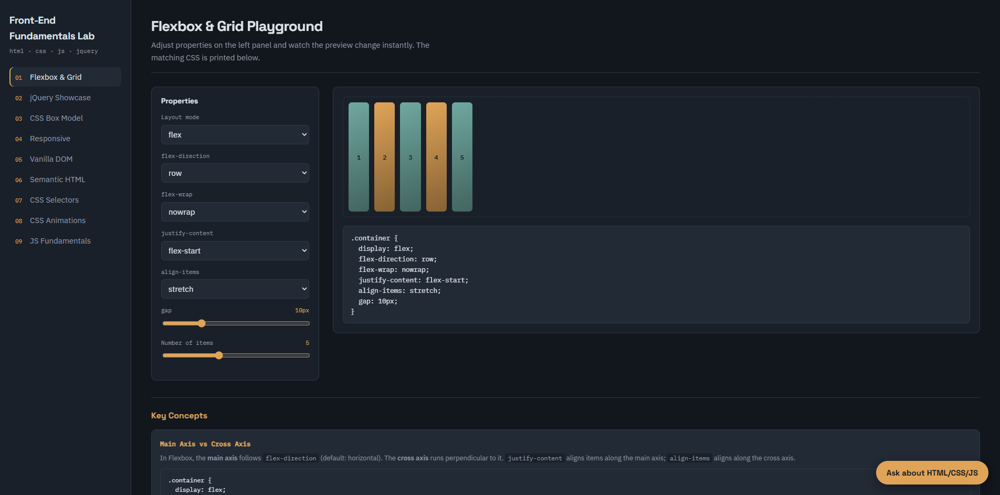
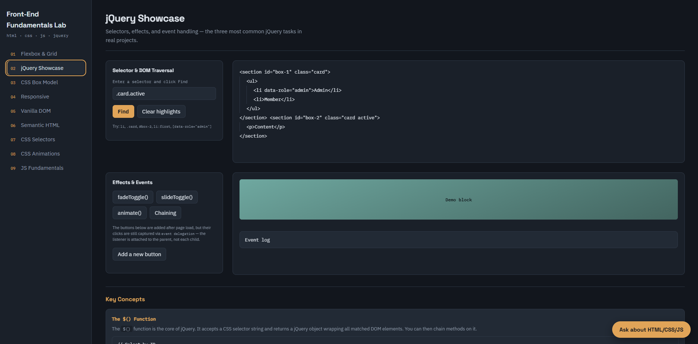
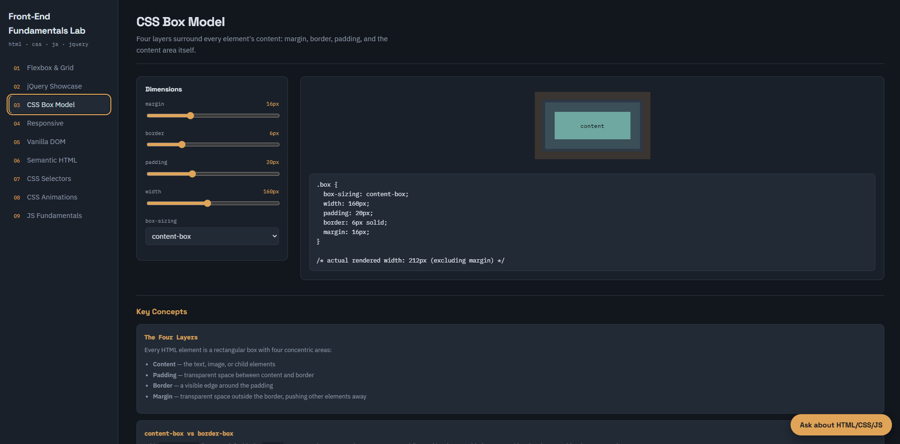
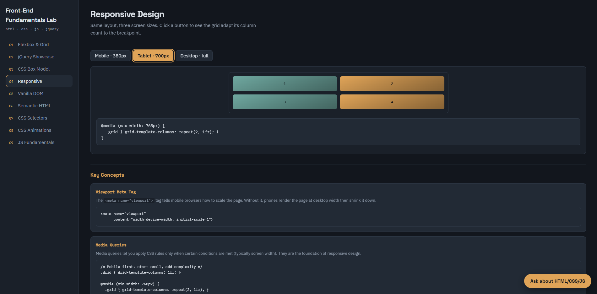
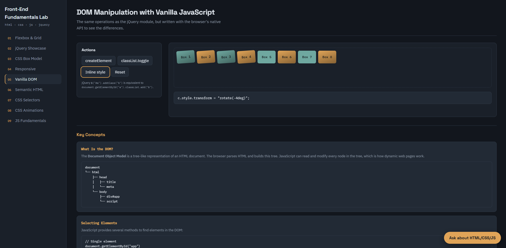
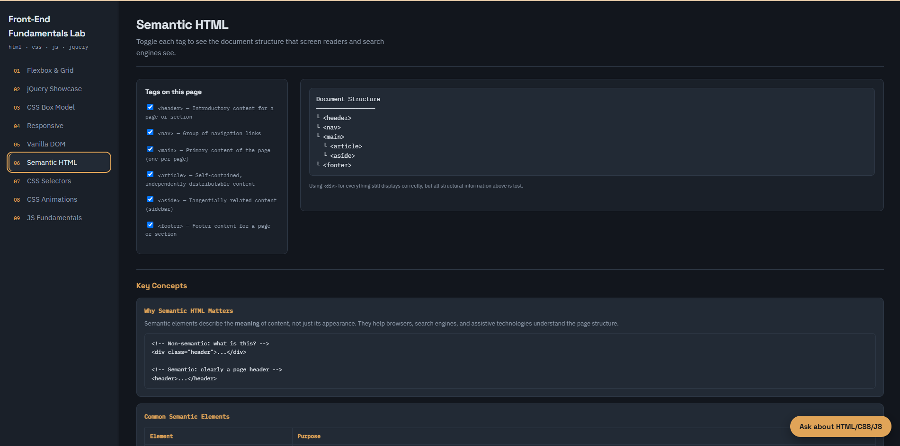
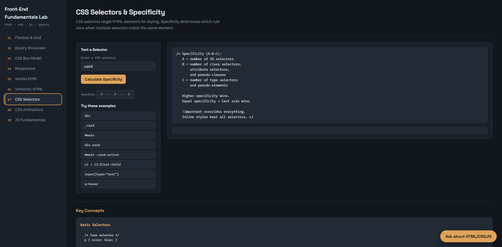
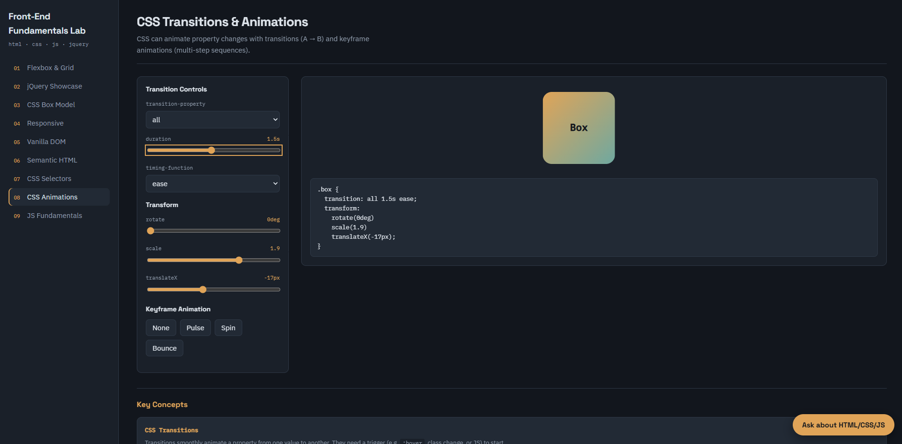
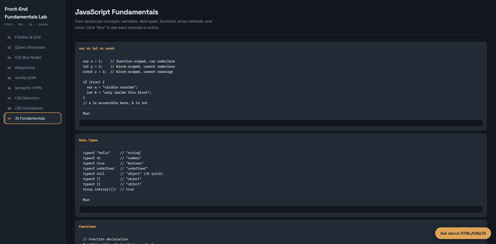
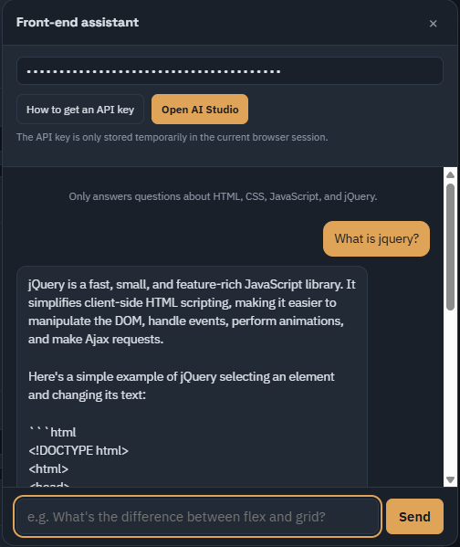

# Front-End Fundamentals Lab

Front-End Fundamentals Lab is a vanilla front-end project built with HTML, CSS, JavaScript, and jQuery. It works as an interactive learning lab where users can explore core front-end concepts directly in the browser: layout systems, jQuery selectors and effects, the CSS box model, responsive behavior, native DOM manipulation, semantic HTML, CSS selectors and specificity, CSS transitions and animations, and JavaScript fundamentals.

The project also includes an AI chatbox powered by the Google Gemini API. The assistant is scoped to front-end topics such as HTML, CSS, JavaScript, and jQuery. Since this project does not have a backend, the API key is entered on the client side and stored temporarily with `sessionStorage`.

## Demo Link

🔗 **Live demo:** [Link](https://front-end-fundamentals-mauve.vercel.app/)

## My project screen capture
### Flexbox & Grid Playground



### jQuery Showcase




### CSS Box Model




### Responsive Preview




### Native DOM & Semantic HTML





### CSS Selectors & Specificity




### CSS Transitions & Animations




### JavaScript Fundamentals




### AI Chatbox




## Tech Stack

- HTML5 for document structure, form controls, and semantic elements
- CSS3 for styling, CSS variables, Flexbox, Grid, transitions, animations, and responsive media queries
- JavaScript for DOM APIs, event handling, `fetch()`, `AbortController`, and `sessionStorage`
- jQuery 3.7.1 for selectors, DOM manipulation, effects, and event delegation
- Google Gemini API for the AI assistant
- Google Fonts for typography (Space Grotesk, IBM Plex Sans, IBM Plex Mono)

## Project Structure

```text
FE project/
├── assets/
│   └── screenshots/
├── index.html   # Main HTML file — page structure and content
├── style.css    # All UI styles, themes, responsive layout
├── jQuery.js    # All JavaScript/jQuery behavior and interactivity
└── README.md    # Project documentation
```
- `index.html`: page structure and content
- `style.css`: UI styling, theme, layout, and responsive behavior
- `jQuery.js`: interactivity, demos, AI chatbox, and API handling

`index.html` imports the CSS in the `<head>` and the JavaScript at the end of `<body>`:

```html
<link rel="stylesheet" href="./style.css">

<script src="https://code.jquery.com/jquery-3.7.1.min.js"></script>
<script src="./jQuery.js"></script>
```

The script order matters because `jQuery.js` uses `$()`, so the jQuery library must be loaded first.

## How To Run Locally

This is a static front-end project. No package installation, build tool, or backend is required.

1. Clone or download the project.
2. Open `index.html` directly in a browser.
3. Optionally, use the Live Server extension in VS Code for a smoother local development experience.

The AI chatbox requires internet access and a valid Gemini API key.

---

## Main Features

### 01 Flexbox & Grid Playground

This module visualizes two important CSS layout systems.

Features:

- Switch between `display: flex` and `display: grid`
- Change `flex-direction`, `flex-wrap`, `justify-content`, and `align-items`
- Change `grid-template-columns` with presets like `repeat()`, `minmax()`, `auto-fit`
- Adjust `gap` and the number of items with range sliders
- Render the matching CSS output live based on user choices

How it works in code:

```js
// jQuery reads all control values and builds a CSS object
var css = {
  display: "flex",
  "flex-direction": $("#fx-dir").val(),
  "flex-wrap": $("#fx-wrap").val(),
  "justify-content": $("#fx-jc").val(),
  "align-items": $("#fx-ai").val(),
  gap: gap + "px",
};

// Apply the CSS object directly to the preview container
$("#fx-stage").css(css);

// Generate CSS text output
var text = ".container {\n";
$.each(css, function (k, v) {
  text += "  " + k + ": " + v + ";\n";
});
$("#fx-css").text(text + "}");
```

Concepts demonstrated:

- **Flexbox** is a one-dimensional layout model: it distributes space along a single axis (main axis). The cross axis is perpendicular.
- **CSS Grid** is a two-dimensional layout model: it handles both rows and columns simultaneously.
- `justify-content` aligns items along the main axis; `align-items` aligns along the cross axis.
- The `gap` property adds space between flex/grid items without using margins.
- The `fr` unit in Grid distributes available free space proportionally.
- `repeat(auto-fit, minmax(90px, 1fr))` creates a responsive grid that auto-adjusts column count.
- jQuery `.css()` can apply an object of CSS properties at once.
- jQuery `.val()` reads the current value from `<select>` and `<input>` elements.

---

### 02 jQuery Showcase

This module demonstrates common jQuery tasks used in front-end development.

Features:

- Test selectors like `.card`, `#box-2`, `li:first`, and `[data-role="admin"]`
- Find matching elements in a sample DOM tree and highlight them visually
- Run jQuery effects such as `fadeToggle()`, `slideToggle()`, and `animate()`
- Demonstrate method chaining (multiple effects in sequence)
- Add dynamic buttons after the page has loaded
- Use event delegation to handle clicks on dynamically created elements

How event delegation works in code:

```js
// Listener is on the PARENT container, not on each .dyn button
$("#jq-dyn").on("click", ".dyn", function () {
  log("Delegation captured: " + $(this).text());
});

// Even buttons added AFTER this listener is set will trigger it
$("#jq-add").on("click", function () {
  added++;
  $('<button class="btn dyn"></button>')
    .text("Button #" + added)
    .appendTo("#jq-dyn");
});
```

Concepts demonstrated:

- **jQuery selectors**: `$()` accepts any CSS selector and returns a jQuery collection.
- **DOM traversal**: `.find()`, `.each()`, `.parent()`, `.children()` navigate the DOM tree.
- **Adding/removing classes**: `.addClass()`, `.removeClass()`, `.toggleClass()`, `.hasClass()`.
- **jQuery effects**: `.fadeToggle()`, `.slideToggle()`, `.animate()` handle animations with a built-in queue.
- **Method chaining**: jQuery methods return the jQuery object, so you can chain calls: `$el.fadeOut(200).fadeIn(200)`.
- **Event delegation**: `.on("click", ".child", handler)` attaches one listener to a parent that filters events by child selector. This works for elements added dynamically.
- **DOM insertion**: `.appendTo()`, `.prependTo()`, `.after()`, `.before()` insert new content.
- **Utility methods**: `$.trim()` removes whitespace; `$.each()` iterates over arrays/objects.

---

### 03 CSS Box Model

This module explains how an HTML element occupies space on the page.

Features:

- Adjust `margin`, `border`, `padding`, and `width` with range sliders
- Visualize the four layers of the box model in real time
- Compare `box-sizing: content-box` and `box-sizing: border-box`
- Calculate and display the real rendered width of the box
- Display the matching CSS output

How the calculation works in code:

```js
// content-box: width only measures content area
// total rendered width = width + 2*padding + 2*border
var inner = sizing === "border-box" ? Math.max(0, w - 2 * p - 2 * b) : w;
var total = sizing === "border-box" ? w : w + 2 * p + 2 * b;
```

Concepts demonstrated:

- **The four layers**: Every HTML element is a box with content, padding, border, and margin.
- **content-box** (browser default): `width` only applies to the content area. Padding and border are added outside, making the element larger than the declared width.
- **border-box**: `width` includes content + padding + border. The content area shrinks to fit. This is more intuitive.
- **Margin collapse**: When two vertical margins touch, they collapse into the larger value (not additive). This only happens vertically and does not apply inside Flex/Grid containers.
- **Best practice**: Apply `*, *::before, *::after { box-sizing: border-box; }` globally to avoid sizing surprises.

---

### 04 Responsive Design

This module simulates layout behavior across different viewport sizes.

Features:

- Mobile preview: 1 column, max-width 380px
- Tablet preview: 2 columns, max-width 700px
- Desktop preview: 4 columns, full width
- Click buttons to switch viewport mode
- Display the matching breakpoint CSS

How it works in code:

```js
// Map viewport names to grid-template-columns values
var cols = {
  mobile: "1fr",
  tablet: "repeat(2, 1fr)",
  desktop: "repeat(4, 1fr)",
}[w];

// Map viewport names to media query descriptions
var q = {
  mobile: "@media (max-width: 480px)",
  tablet: "@media (max-width: 768px)",
  desktop: "/* default */",
}[w];
```

Concepts demonstrated:

- **Viewport meta tag**: `<meta name="viewport" content="width=device-width, initial-scale=1">` tells mobile browsers how to scale the page.
- **Media queries**: `@media (max-width: 768px) { ... }` applies CSS rules only when conditions are met.
- **Breakpoints**: Common breakpoints are 480px (mobile), 768px (tablet), 1024px (desktop).
- **Mobile-first vs desktop-first**: Mobile-first uses `min-width` (add complexity for larger screens); desktop-first uses `max-width` (simplify for smaller screens).
- **CSS units**: `px` (fixed pixels), `%` (parent-relative), `em` (font-size-relative), `rem` (root font-size-relative), `vw`/`vh` (viewport-relative), `fr` (grid free space).
- **`data-*` attributes as UI state**: The project uses `data-w` on the viewport container to control max-width via CSS attribute selectors.

---

### 05 Vanilla DOM Manipulation

This module shows how to manipulate the DOM without jQuery.

Features:

- Create elements with `document.createElement()`
- Insert elements with `appendChild()`
- Toggle classes with `classList.toggle()`
- Change inline styles with `element.style`
- Reset content with `innerHTML`
- Display the matching JavaScript snippet after each action

How it works in code:

```js
// Create and insert a new element
document.getElementById("dm-create").addEventListener("click", function () {
  dmCount++;
  var el = document.createElement("div");
  el.className = "chip";
  el.textContent = "Box " + dmCount;
  document.getElementById("dm-stage").appendChild(el);
});

// Toggle a CSS class on all child elements
document.getElementById("dm-toggle").addEventListener("click", function () {
  document.querySelectorAll("#dm-stage .chip").forEach(function (c) {
    c.classList.toggle("bm-content");
  });
});
```

Concepts demonstrated:

- **The DOM**: The Document Object Model is a tree representation of HTML that JavaScript can read and modify.
- **Selecting elements**: `getElementById()`, `querySelector()`, `querySelectorAll()`, `getElementsByClassName()`.
- **Creating elements**: `document.createElement()` creates a new node; `appendChild()` adds it to the tree.
- **Class manipulation**: `classList.add()`, `.remove()`, `.toggle()`, `.contains()` — the vanilla equivalents of jQuery's `addClass`, `removeClass`, etc.
- **Inline styles**: `element.style.property = value` sets CSS directly on an element.
- **Event handling**: `addEventListener("event", callback)` — no need for jQuery to handle events.
- **Key difference from jQuery**: jQuery wraps elements in a collection object with chainable methods. Vanilla JS works directly with DOM nodes and NodeLists.

---

### 06 Semantic HTML

This module demonstrates semantic HTML: using elements based on meaning, not only appearance.

Features:

- Toggle each semantic tag on/off to see the document outline
- See the structure that screen readers and search engines interpret
- Compare semantic structure to `<div>`-only structure

Elements demonstrated:

| Element     | Purpose                                                |
|-------------|--------------------------------------------------------|
| `<header>`  | Introductory content for a page or section             |
| `<nav>`     | Group of navigation links                              |
| `<main>`    | Primary content of the page (one per page)             |
| `<article>` | Self-contained, independently distributable content    |
| `<section>` | Thematic grouping of content                           |
| `<aside>`   | Tangentially related content (sidebar)                 |
| `<footer>`  | Footer content for a page or section                   |
| `<figure>`  | Self-contained media with optional caption             |
| `<time>`    | Date/time with machine-readable value                  |
| `<mark>`    | Highlighted/marked text                                |

Concepts demonstrated:

- **Semantic HTML** describes the meaning of content, not its appearance.
- **SEO benefit**: Search engines use semantic tags to understand content hierarchy.
- **Accessibility benefit**: Screen readers create a navigable outline from semantic elements, letting users jump between sections.
- **Maintainability**: Developers can scan code and immediately understand page structure.
- **ARIA attributes** (`aria-label`, `aria-expanded`, `aria-controls`) enhance accessibility when semantic HTML alone is not enough.

---

### 07 CSS Selectors & Specificity

This module explains CSS selectors and how specificity determines which rule wins.

Features:

- Enter any CSS selector and calculate its specificity score (A–B–C)
- Click predefined examples to see specificity breakdowns
- Learn about basic selectors, combinators, pseudo-classes, and pseudo-elements

How the specificity calculator works in code:

```js
function calcSpecificity(sel) {
  var a = 0, b = 0, c = 0;
  // a = number of ID selectors (#id)
  // b = number of class selectors (.class), attribute selectors ([attr]),
  //     and pseudo-classes (:hover, :nth-child, etc.)
  // c = number of type selectors (div, p) and pseudo-elements (::before)

  var ids = cleaned.match(/#[a-zA-Z_][\w-]*/g);
  if (ids) a += ids.length;
  // ... count classes, attributes, pseudo-classes, types
  return [a, b, c];
}
```

Concepts demonstrated:

- **Basic selectors**: type (`div`), class (`.card`), ID (`#main`), universal (`*`), attribute (`[type="text"]`).
- **Combinators**: descendant (space), child (`>`), adjacent sibling (`+`), general sibling (`~`).
- **Pseudo-classes**: `:hover`, `:focus`, `:first-child`, `:nth-child()`, `:not()`, `:checked`.
- **Pseudo-elements**: `::before`, `::after`, `::first-line`, `::placeholder`.
- **Specificity calculation**: `(A, B, C)` where A = IDs, B = classes/attributes/pseudo-classes, C = types/pseudo-elements.
- **Cascade order**: When specificity is equal, the last rule in source order wins.
- **`!important`**: Overrides all specificity, but should be avoided in most cases.
- **Inline styles**: `style="..."` beats all selector-based specificity.

---

### 08 CSS Transitions & Animations

This module demonstrates CSS transitions, transforms, and keyframe animations.

Features:

- Control transition properties: `transition-property`, `duration`, `timing-function`
- Adjust CSS transforms: `rotate`, `scale`, `translateX`
- Toggle keyframe animations: `pulse`, `spin`, `bounce`
- See the generated CSS output in real time

How it works in code:

```js
function renderAnim() {
  var $box = $("#anim-target");
  $box.css({
    "transition-property": prop,
    "transition-duration": dur + "s",
    "transition-timing-function": tf,
    transform: "rotate(" + rotate + "deg) scale(" + scale + ") translateX(" + tx + "px)"
  });
}

// Keyframe animation toggle
if (kf === "none") {
  $box.css("animation", "none");
} else {
  $box.css("animation", kf + " 1s ease infinite");
}
```

Concepts demonstrated:

- **CSS transitions**: Smoothly animate property changes from one value to another. Syntax: `transition: property duration timing-function delay`.
- **Timing functions**: `ease`, `linear`, `ease-in`, `ease-out`, `ease-in-out`, `cubic-bezier()`.
- **CSS transforms**: Change shape, size, and position without affecting document flow. Functions: `rotate()`, `scale()`, `translateX/Y()`, `skewX/Y()`.
- **Performance**: `transform` and `opacity` are GPU-accelerated — the cheapest properties to animate.
- **`@keyframes` animations**: Define multi-step animations that can run automatically. Syntax: `animation: name duration timing iteration`.
- **Key difference**: Transitions need a trigger (hover, class change); keyframe animations run independently.
- **`prefers-reduced-motion`**: The project includes `@media (prefers-reduced-motion: reduce)` to respect users who prefer less motion.

---

### 09 JavaScript Fundamentals

This module covers core JavaScript concepts with interactive runnable examples.

Features:

- Variables: `var` vs `let` vs `const` — scope and hoisting differences
- Data types: `typeof`, `Array.isArray()`, type quirks
- Functions: declaration, expression, arrow functions, callbacks
- Array methods: `map`, `filter`, `find`, `every`, `some`, `reduce`, `indexOf`, `includes`
- String methods: `length`, `toUpperCase`, `toLowerCase`, `indexOf`, `includes`, `split`, `slice`, `replace`, `trim`
- Comparison operators: `==` vs `===`, logical operators, ternary
- Objects: dot notation, bracket notation, `Object.keys()`, `Object.values()`, `in`
- JSON & Fetch API: `JSON.stringify()`, `JSON.parse()`, `fetch()` with Promises

How the interactive examples work in code:

```js
var jsExamples = {
  arrays: function () {
    var nums = [1, 2, 3, 4, 5];
    var results = [];
    results.push(".map(n => n * 2)    → [" + nums.map(function(n){ return n*2; }).join(", ") + "]");
    results.push(".filter(n => n > 3) → [" + nums.filter(function(n){ return n>3; }).join(", ") + "]");
    // ... more examples
    return results.join("\n");
  },
  // ... other categories
};

// Click "Run" to execute and display output
$("#m-jsbasic").on("click", "[data-jsrun]", function () {
  var key = $(this).data("jsrun");
  $("#js-out-" + key).text(jsExamples[key]());
});
```

Concepts demonstrated:

- **`var` is function-scoped** and hoisted; `let` and `const` are block-scoped with temporal dead zone.
- **Best practice**: Use `const` by default, `let` when reassignment is needed, avoid `var`.
- **Closures**: A function that remembers variables from its outer scope even after the outer function returns.
- **Callback functions**: Functions passed as arguments to other functions — the foundation of async JavaScript.
- **Array methods** are non-destructive (they return new arrays) except for `push`, `pop`, `splice`, etc.
- **`==` vs `===`**: Double equals does type coercion (`"5" == 5` is true); triple equals is strict (`"5" === 5` is false).
- **`JSON.stringify()` / `JSON.parse()`**: Convert between JavaScript objects and JSON strings for API communication.
- **Fetch API**: Modern replacement for `XMLHttpRequest`. Returns a Promise for async HTTP requests.
- **`sessionStorage` vs `localStorage`**: Both store key-value strings in the browser. `sessionStorage` clears when the tab closes; `localStorage` persists.

---

## AI Chatbox Integration

The project includes an AI assistant named "Front-end assistant". It uses the Google Gemini API to answer questions about HTML, CSS, JavaScript, and jQuery.

User flow:

1. The user clicks `Ask about HTML/CSS/JS`.
2. The chatbox opens.
3. The user enters a Gemini API key.
4. If the user does not have a key, they can open the API key guide.
5. The guide links to Google AI Studio API Keys.
6. The user creates a new key and pastes it into the input.
7. The user submits a front-end question.
8. JavaScript sends a request to the Gemini API with `fetch()`.
9. The response is rendered inside the chat log.

API key page:

```text
https://aistudio.google.com/api-keys
```

## AI Implementation Details

The AI logic is implemented in `jQuery.js`.

Main parts:

- `SYSTEM`: system instruction that limits the assistant to HTML, CSS, JavaScript, and jQuery
- `MODEL`: the Gemini model used by the app (`gemini-2.5-flash`)
- `callGemini()`: sends the request to the Gemini API with retry logic
- `readResponse()`: extracts response text and handles blocked or empty responses
- `explain()`: converts HTTP errors into human-readable messages
- `isRetryable()`: decides which errors should be retried
- `push()`: appends messages to the chat log
- `busy`: prevents duplicate submissions while a request is running

The request is sent with the REST API:

```js
fetch("https://generativelanguage.googleapis.com/v1beta/models/" + MODEL + ":generateContent", {
  method: "POST",
  headers: {
    "Content-Type": "application/json",
    "x-goog-api-key": key
  },
  body: JSON.stringify({
    systemInstruction: { parts: [{ text: SYSTEM }] },
    contents: [{ role: "user", parts: [{ text: question }] }],
    generationConfig: { temperature: 0.3, maxOutputTokens: 800 }
  })
});
```

## API Key Storage

The API key is stored with `sessionStorage`:

```js
sessionStorage.setItem(KEY, value);
sessionStorage.getItem(KEY);
```

Meaning:

- The key only exists during the current browser session
- It is cleared when the browser tab/session is closed
- The project does not have a backend, database, or custom server that stores the key
- This approach is suitable for a learning/demo project

Security note:

- Because the request is sent directly from the browser to the Gemini API, the API key can still be visible in DevTools/Network
- This approach should not be used for production
- A real production app should use a backend or proxy to protect the API key

## AI Error Handling

The project handles several common AI/API failure cases:

- Missing API key: asks the user to enter a key before submitting
- HTTP `400`: invalid key or malformed request
- HTTP `401`/`403`: rejected key or missing API permission
- HTTP `404`: model not found or the key cannot access the model
- HTTP `429`: quota or rate limit exceeded
- HTTP `500+`: temporary Gemini server issue
- Timeout: uses `AbortController` to cancel long requests
- Network/CORS error: shows a connection error message
- Safety block: warns when the prompt or response is blocked by safety filters
- Empty response: warns when Gemini returns no usable content
- `MAX_TOKENS`: warns when the response is truncated

Retry behavior:

- Retryable statuses: `429`, `500`, `502`, `503`, `504`
- Network-like failures are also retried
- Maximum attempts: 3
- Delay increases gradually between attempts

---

## Knowledge Demonstrated — HTML

### HTML5 Document Structure

Every HTML document begins with a `<!DOCTYPE html>` declaration, which tells the browser to use standards mode. The `<html>` element wraps the entire page, `<head>` contains metadata, and `<body>` contains visible content.

```html
<!DOCTYPE html>
<html lang="en" data-theme="dark">
<head>
    <meta charset="utf-8">
    <meta name="viewport" content="width=device-width, initial-scale=1">
    <title>Front-End Fundamentals Lab</title>
    <link rel="stylesheet" href="./style.css">
</head>
<body>
    <!-- visible content -->
    <script src="./jQuery.js"></script>
</body>
</html>
```

Key points:

- `charset="utf-8"` ensures the page supports international characters.
- `viewport` meta tag enables proper rendering on mobile devices.
- CSS is loaded in `<head>` so styles are applied before content renders (avoids flash of unstyled content).
- JavaScript is loaded at the end of `<body>` so the DOM is ready before scripts execute.

### Semantic HTML Elements

This project uses semantic elements to provide meaning to the document structure:

| Element     | Used for                              | Project usage                    |
|-------------|---------------------------------------|----------------------------------|
| `<aside>`   | Sidebar / secondary content           | Navigation sidebar (`.rail`)     |
| `<main>`    | Primary page content                  | Module container area            |
| `<section>` | Thematic grouping                     | Each learning module             |
| `<form>`    | User input collection                 | Chat form                        |
| `<ul>/<li>` | Unordered list                        | Navigation list                  |
| `<ol>/<li>` | Ordered list                          | API key guide steps              |
| `<pre>`     | Preformatted text                     | Code output blocks               |
| `<code>`    | Inline code                           | Code references in descriptions  |
| `<strong>`  | Important text                        | Chat title                       |

### Data Attributes

HTML5 `data-*` attributes store custom data on elements. This project uses them extensively to connect UI elements to JavaScript logic:

```html
<!-- Navigation: data-target links button to module section -->
<button data-target="m-flex">Flexbox & Grid</button>
<section id="m-flex" class="module">...</section>

<!-- Conditional display: data-when shows/hides panels based on mode -->
<div data-when="flex">...</div>
<div data-when="grid">...</div>

<!-- Effect triggers: data-fx specifies which jQuery effect to run -->
<button data-fx="fadeToggle">fadeToggle()</button>

<!-- Responsive preview: data-vp and data-w control viewport simulation -->
<button data-vp="mobile">Mobile</button>
<div class="vp" data-w="desktop" id="vp">...</div>

<!-- Theme: data-theme controls color scheme -->
<html data-theme="dark">

<!-- JS examples: data-jsrun triggers specific JS demo -->
<button data-jsrun="arrays">Run</button>

<!-- Specificity: data-sel provides preset selector examples -->
<button data-sel=".card">.card</button>

<!-- Keyframe: data-kf selects animation -->
<button data-kf="pulse">Pulse</button>
```

### Form Elements

The project uses various form elements for interactive controls:

```html
<!-- Select dropdown for choosing values -->
<select id="fx-mode">
    <option value="flex">flex</option>
    <option value="grid">grid</option>
</select>

<!-- Range slider for numeric values -->
<input type="range" id="fx-gap" min="0" max="40" value="10">

<!-- Text input for user queries -->
<input type="text" id="jq-sel" value=".card.active">

<!-- Password input for API key (hidden characters) -->
<input type="password" id="apiKey" placeholder="Paste your Gemini API key">

<!-- Checkbox for toggling semantic tags -->
<input type="checkbox" checked data-tag="header">

<!-- Labels link to inputs for accessibility -->
<label for="fx-mode">Layout mode</label>
```

### Accessibility Attributes

The project uses ARIA attributes to enhance accessibility:

```html
<!-- aria-controls: identifies the element this button controls -->
<button aria-controls="aiGuide" aria-expanded="false">How to get an API key</button>

<!-- aria-expanded: communicates open/closed state to screen readers -->
<!-- Updated dynamically by JavaScript -->

<!-- aria-label: provides accessible name when visual text is insufficient -->
<button id="chatClose" aria-label="Close">×</button>
```

---

## Knowledge Demonstrated — CSS

### CSS Custom Properties (Variables)

CSS custom properties (variables) enable a centralized design system. The project declares variables in `:root` for the dark theme and overrides them for the light theme:

```css
:root {
    --bg: #12161d;
    --panel: #1a2029;
    --panel-2: #222a35;
    --line: #2e3846;
    --ink: #dde3ea;
    --ink-dim: #8f9bab;
    --accent: #e0a458;
    --accent-2: #6fa8a0;
    --radius: 10px;
    --mono: 'IBM Plex Mono', ui-monospace, monospace;
    --sans: 'IBM Plex Sans', system-ui, -apple-system, 'Segoe UI', sans-serif;
    --display: 'Space Grotesk', var(--sans);
}

html[data-theme="light"] {
    --bg: #edf0f4;
    --panel: #ffffff;
    --ink: #1d242e;
    --accent: #a9661a;
    /* ... overrides for light theme */
}

/* Usage */
body {
    background: var(--bg);
    color: var(--ink);
    font-family: var(--sans);
}
```

Benefits:

- Change the entire theme by swapping one `data-theme` attribute
- All colors, fonts, and spacing are defined in one place
- Variables cascade and can be overridden at any level

### Flexbox Layout

The project uses Flexbox extensively for one-dimensional layouts:

```css
/* Navigation sidebar: vertical column layout */
.rail {
    display: flex;
    flex-direction: column;
    gap: 22px;
}

/* Button rows: horizontal wrapping layout */
.btn-row {
    display: flex;
    flex-wrap: wrap;
    gap: 8px;
}

/* Centering content */
.bm {
    display: flex;
    align-items: center;
    justify-content: center;
}

/* Push footer to bottom with flex-grow */
.rail-foot {
    margin-top: auto;  /* pushes to bottom of flex container */
}
```

Key properties:

| Property          | Values                                      | Axis  |
|-------------------|---------------------------------------------|-------|
| `flex-direction`  | `row`, `column`, `row-reverse`, `column-reverse` | Sets main axis |
| `flex-wrap`       | `nowrap`, `wrap`, `wrap-reverse`             | Controls wrapping |
| `justify-content` | `flex-start`, `center`, `space-between`, etc.| Main axis |
| `align-items`     | `stretch`, `center`, `flex-start`, etc.      | Cross axis |
| `gap`             | Length value (e.g., `8px`)                   | Between items |
| `flex-grow`       | Number (e.g., `1`)                           | Item expansion |
| `align-self`      | Overrides `align-items` for one item         | Cross axis |

### CSS Grid Layout

The project uses Grid for two-dimensional layouts:

```css
/* Main page layout: sidebar + content */
.shell {
    display: grid;
    grid-template-columns: 250px 1fr;
    min-height: 100vh;
}

/* Two-panel layout: controls + preview */
.split {
    display: grid;
    grid-template-columns: minmax(260px, 320px) 1fr;
    gap: 26px;
    align-items: start;
}

/* Responsive viewport preview */
.vp[data-w="desktop"] .vp-grid {
    grid-template-columns: repeat(4, 1fr);
}
.vp[data-w="tablet"] .vp-grid {
    grid-template-columns: repeat(2, 1fr);
}
.vp[data-w="mobile"] .vp-grid {
    grid-template-columns: 1fr;
}

/* Auto-fill responsive grid for knowledge cards */
.card-grid {
    display: grid;
    grid-template-columns: repeat(auto-fill, minmax(290px, 1fr));
    gap: 14px;
}
```

### Transitions and Animations

```css
/* Smooth color transitions when theme changes */
body {
    transition: background .25s ease, color .25s ease;
}

/* Button hover transitions */
.btn {
    transition: border-color .18s, transform .1s;
}
.btn:hover { border-color: var(--accent); }
.btn:active { transform: translateY(1px); }

/* Module reveal animation */
@keyframes rise {
    from { opacity: 0; transform: translateY(8px); }
    to { opacity: 1; transform: none; }
}
.module.is-on {
    animation: rise .28s ease both;
}

/* Reduced motion preference */
@media (prefers-reduced-motion: reduce) {
    * {
        animation-duration: .01ms !important;
        transition-duration: .01ms !important;
    }
}
```

### Colors and Gradients

```css
/* Linear gradient on chips */
.chip {
    background: linear-gradient(160deg, var(--accent-2),
        color-mix(in srgb, var(--accent-2) 60%, #000));
}

/* Alternating colors with nth-child */
.chip:nth-child(even) {
    background: linear-gradient(160deg, var(--accent),
        color-mix(in srgb, var(--accent) 60%, #000));
}

/* Semi-transparent backgrounds */
.bm-margin { background: rgba(224, 164, 88, .16); }
.bm-padding { background: rgba(111, 168, 160, .2); }
```

### Typography

```css
/* Google Fonts import with preconnect for performance */
<link rel="preconnect" href="https://fonts.googleapis.com">
<link href="https://fonts.googleapis.com/css2?family=Space+Grotesk:wght@500;700
    &family=IBM+Plex+Sans:wght@400;500;600
    &family=IBM+Plex+Mono:wght@400;500&display=swap"
    rel="stylesheet">

/* Font family variables with fallback stacks */
--mono: 'IBM Plex Mono', ui-monospace, monospace;
--sans: 'IBM Plex Sans', system-ui, -apple-system, 'Segoe UI', sans-serif;
--display: 'Space Grotesk', var(--sans);
```

### Responsive Media Queries

```css
@media (max-width: 880px) {
    /* Switch from sidebar to stacked layout */
    .shell { grid-template-columns: 1fr; }
    .rail { border-right: 0; border-bottom: 1px solid var(--line); }

    /* Navigation becomes horizontal */
    .nav { flex-direction: row; flex-wrap: wrap; }
    .nav button { width: auto; }

    /* Panels stack vertically */
    .split { grid-template-columns: 1fr; }
    .card-grid { grid-template-columns: 1fr; }
}
```

### CSS Selectors Used in This Project

```css
/* Attribute selector with data-theme */
html[data-theme="light"] { --bg: #edf0f4; }

/* Attribute selector with data-w */
.vp[data-w="mobile"] { max-width: 380px; }

/* Pseudo-class :nth-child for alternating styles */
.chip:nth-child(even) { background: ...; }

/* Pseudo-class :focus-visible for keyboard focus */
:focus-visible { outline: 2px solid var(--accent); }

/* Pseudo-element combinator (universal + pseudo-elements) */
*, *::before, *::after { box-sizing: border-box; }

/* Descendant selector */
.nav button { width: 100%; }

/* Class chaining */
.nav button.is-active { box-shadow: inset 2px 0 0 var(--accent); }
.module.is-on { display: block; }
```

---

## Knowledge Demonstrated — JavaScript

### DOM Selection and Manipulation

```js
// Select single element by ID
document.getElementById("dm-stage")

// Select single element by CSS selector
document.querySelector(".card")

// Select all matching elements (returns NodeList)
document.querySelectorAll("#dm-stage .chip")

// Create new element
var el = document.createElement("div");
el.className = "chip";
el.textContent = "Box 1";

// Insert into DOM
document.getElementById("dm-stage").appendChild(el);

// Modify classes
el.classList.add("active");
el.classList.remove("active");
el.classList.toggle("active");

// Modify inline styles
el.style.transform = "rotate(-4deg)";

// Clear content
element.innerHTML = "";
```

### Event Handling

```js
// addEventListener with named function
document.getElementById("dm-create").addEventListener("click", function() {
  // event handler logic
});

// Multiple event types: click, input, change, submit
// Used in this project for:
// - click: buttons, navigation
// - input: range sliders (real-time updates)
// - change: select dropdowns, checkboxes
// - submit: chat form

// Event object properties
element.addEventListener("click", function(event) {
  event.target        // the element that triggered the event
  event.preventDefault()  // prevent default behavior (form submission)
  event.stopPropagation() // stop event from bubbling up
});
```

### Fetch API and AbortController

```js
// AbortController for request timeout
var controller = new AbortController();
var timer = setTimeout(function() {
  controller.abort();
}, 30000);

// Fetch with signal for cancellation
fetch(url, {
  method: "POST",
  headers: { "Content-Type": "application/json", "x-goog-api-key": key },
  signal: controller.signal,
  body: JSON.stringify({ ... })
})
  .then(function(r) {
    clearTimeout(timer);
    if (r.ok) return r.json();
    return r.text().then(function(body) {
      var err = new Error("HTTP error");
      err.status = r.status;
      throw err;
    });
  })
  .catch(function(err) {
    if (err.name === "AbortError") {
      // Request was cancelled due to timeout
    }
  });
```

### Promise Chains and Retry Logic

```js
function callGemini(key, question, attempt) {
  attempt = attempt || 1;
  return fetch(url, options)
    .then(handleResponse)
    .catch(function(err) {
      // Retry on certain errors with exponential backoff
      if (attempt < 3 && isRetryable(err.status)) {
        return new Promise(function(resolve) {
          setTimeout(resolve, 1000 * attempt);
        }).then(function() {
          return callGemini(key, question, attempt + 1);
        });
      }
      throw err;
    });
}
```

### sessionStorage

```js
// Store API key for current session
var KEY = "ffl_gemini_key";

// Save
sessionStorage.setItem(KEY, value);

// Load (with error handling for private browsing)
var saved = null;
try {
  saved = sessionStorage.getItem(KEY);
} catch (e) {}

// Key characteristics:
// - Scoped to the current tab
// - Cleared when the tab/session is closed
// - ~5 MB storage limit
// - Only stores strings
```

### String and Array Methods Used

```js
// String methods
$.trim(value)           // remove leading/trailing whitespace
str.split(/\s+/)        // split by whitespace (regex)
str.indexOf("text")     // find position (-1 if not found)

// Array methods
array.filter(Boolean)   // remove falsy values
array.every(fn)         // true if all elements pass test
array.forEach(fn)       // iterate without creating new array
array.map(fn)           // transform each element, return new array
array.join("")          // concatenate into string

// JSON
JSON.stringify(obj)     // object → JSON string
JSON.parse(str)         // JSON string → object
```

### Error Handling Patterns

```js
// try/catch for synchronous errors
try {
  found = $("#jq-real").find(sel);
} catch (e) {
  $("#jq-count").text("Invalid selector.");
  return;
}

// Promise .catch for async errors
callGemini(key, q)
  .then(function(data) { /* success */ })
  .catch(function(err) { /* failure */ });

// Error objects with custom properties
var err = new Error("message");
err.status = 400;
throw err;
```

---

## Knowledge Demonstrated — jQuery

### $(document).ready()

```js
$(document).ready(function() {
  // All jQuery code runs inside this callback
  // It fires when the DOM is fully loaded (but images may not be ready)
  // Equivalent to: document.addEventListener("DOMContentLoaded", fn)
});
```

### jQuery Selectors

```js
// By ID
$("#box-2")

// By class
$(".card")

// By element type
$("li")

// By attribute
$('[data-role="admin"]')

// Combined selectors
$(".card.active")

// Pseudo-selectors (jQuery extensions)
$("li:first")

// Descendant
$(".card p")

// Multiple selectors
$("input, select")
```

### DOM Manipulation

```js
// Read/write text content
$(el).text()              // get text
$(el).text("Hello")       // set text

// Read/write HTML content
$(el).html()              // get HTML
$(el).html("<b>Bold</b>") // set HTML

// Read/write form values
$(el).val()               // get value
$(el).val("new")          // set value

// Read/write attributes
$(el).attr("data-theme")          // get attribute
$(el).attr("data-theme", "dark")  // set attribute
$(el).removeAttr("style")         // remove attribute

// Read/write CSS
$(el).css("color")              // get computed style
$(el).css("color", "red")       // set single property
$(el).css({ color: "red", fontSize: "14px" })  // set multiple

// Class manipulation
$(el).addClass("active")
$(el).removeClass("active")
$(el).toggleClass("active")
$(el).hasClass("active")     // returns true/false

// DOM insertion
$("<div></div>").appendTo("#parent")
$(el).prependTo("#parent")
$(el).empty()              // remove all children
```

### jQuery Effects

```js
// Show/hide
$(el).show()
$(el).hide()
$(el).toggle()

// Fade
$(el).fadeIn(300)
$(el).fadeOut(300)
$(el).fadeToggle(300)

// Slide
$(el).slideUp(300)
$(el).slideDown(300)
$(el).slideToggle(300)

// Custom animation
$(el).animate({ height: 190 }, 260)

// Method chaining (animations queue automatically)
$(el).fadeOut(180)
     .fadeIn(180)
     .animate({ height: 160 }, 220)
     .animate({ height: 110 }, 220);
```

### Event Handling and Delegation

```js
// Direct binding
$(el).on("click", function() { ... });

// Event delegation: listener on parent, filter by child selector
// Works for elements that don't exist yet
$(parent).on("click", ".child-selector", function() {
  $(this)  // refers to the matched child element
});

// Multiple event types
$(el).on("input change", "select, input", handler);

// Trigger events programmatically
$(el).trigger("click");
$(el).trigger("focus");

// Form submission
$(form).on("submit", function(e) {
  e.preventDefault();  // prevent page reload
  // handle form data
});
```

### jQuery Utility Methods

```js
// Trim whitespace
$.trim("  hello  ")  // "hello"

// Iterate over object properties
$.each(cssObj, function(key, value) {
  text += "  " + key + ": " + value + ";\n";
});

// Iterate over jQuery collection
$("li").each(function(index) {
  $(this).text()  // access each element
});

// DOM traversal
$(el).find(".child")      // find descendants
$(el).parent()            // get parent
$(el).children()          // get direct children
$(el).siblings()          // get siblings
$(el).closest(".ancestor") // find nearest ancestor matching selector
```

---

## Notable Implementation Details

### Theme Switching

The theme is controlled by an attribute on the `html` element:

```html
<html data-theme="dark">
```

When the user clicks the theme button, JavaScript switches the value between `dark` and `light`. CSS variables then update all colors automatically:

```js
$("#themeBtn").on("click", function() {
  var light = $("html").attr("data-theme") === "light";
  $("html").attr("data-theme", light ? "dark" : "light");
  $(this).text(light ? "Switch to light theme" : "Switch to dark theme");
});
```

### Tab Navigation

The sidebar uses `data-target` to connect each button to a module:

```html
<button data-target="m-flex">Flexbox & Grid</button>
<section id="m-flex" class="module"></section>
```

When a tab is clicked, jQuery:

1. Removes `is-active` from the previous button
2. Adds `is-active` to the clicked button
3. Hides all `.module` sections (removes `is-on`)
4. Shows the target section (adds `is-on`)

### Event Delegation

The project uses event delegation for dynamically created elements. For example, the jQuery demo can create new buttons after page load, and the parent container still catches their click events:

```js
$("#jq-dyn").on("click", ".dyn", function () {
  log("Delegation captured: " + $(this).text());
});
```

This technique is commonly used when rendering dynamic items from APIs or user actions.

### Accessibility Touches

The API key guide button uses:

- `aria-controls`: identifies the element this button controls
- `aria-expanded`: communicates the current open/closed state

This makes the collapsible guide clearer for assistive technologies.

---

## Deployment

Yes, this project can be deployed on Vercel.

Because this is a static HTML/CSS/JS project, there is no build step. Vercel can serve the project as static files as long as `index.html` is in the project root.

### Option 1: Deploy With Vercel And GitHub

1. Push the project to a GitHub repository.
2. Go to Vercel.
3. Choose `Add New Project`.
4. Import your GitHub repository.
5. For framework preset, choose `Other` if Vercel does not detect a framework.
6. Leave the build command empty.
7. Leave the output directory as the project root, or `.` if Vercel asks for a value.
8. Click `Deploy`.

After deployment, every push to the connected GitHub branch can trigger a new Vercel deployment.

### Option 2: Deploy With Vercel CLI

Install Vercel CLI:

```bash
npm install -g vercel
```

From the project folder:

```bash
vercel
```

For production:

```bash
vercel --prod
```

### Option 3: GitHub Pages

This project can also be deployed with GitHub Pages.

1. Push the project to GitHub.
2. Open the repository settings.
3. Go to `Pages`.
4. Select the branch, usually `main`.
5. Select the root folder.
6. Save.

GitHub Pages is enough for this project because it is fully static.

## Push To GitHub

If the folder is not a Git repository yet:

```bash
git init
git add .
git commit -m "Initial commit"
git branch -M main
git remote add origin https://github.com/YOUR_USERNAME/YOUR_REPOSITORY_NAME.git
git push -u origin main
```

If the repository already exists locally:

```bash
git add .
git commit -m "Update front-end fundamentals lab"
git push
```

Before pushing, make sure you do not commit any real API keys. This project does not hardcode a key, so it is safe as long as you do not add one manually.

## Knowledge Summary

### HTML
- HTML5 document structure (`<!DOCTYPE>`, `<html>`, `<head>`, `<body>`)
- Meta tags (`charset`, `viewport`)
- Semantic elements (`<header>`, `<nav>`, `<main>`, `<article>`, `<aside>`, `<footer>`, `<section>`)
- Form elements (`<input>`, `<select>`, `<button>`, `<label>`, `<form>`)
- Data attributes (`data-target`, `data-when`, `data-fx`, `data-vp`, `data-theme`, `data-w`, `data-kf`, `data-sel`, `data-jsrun`)
- Accessibility attributes (`aria-controls`, `aria-expanded`, `aria-label`)
- External resource loading (`<link>`, `<script>`)
- Content elements (`<pre>`, `<code>`, `<ul>`, `<ol>`, `<li>`, `<div>`, `<span>`, `<a>`, `<strong>`)

### CSS
- CSS custom properties (`:root` variables, `var()`, theme switching)
- Flexbox (`display: flex`, `flex-direction`, `flex-wrap`, `justify-content`, `align-items`, `gap`, `align-self`)
- CSS Grid (`display: grid`, `grid-template-columns`, `repeat()`, `minmax()`, `auto-fit`, `auto-fill`, `fr` unit)
- Box model (`margin`, `border`, `padding`, `width`, `box-sizing`)
- Responsive design (`@media`, breakpoints, `min-width`, `max-width`)
- CSS selectors (type, class, ID, attribute, pseudo-class, pseudo-element, combinators)
- Specificity (A–B–C scoring, cascade, `!important`, inline styles)
- Transitions (`transition`, `transition-property`, `transition-duration`, `transition-timing-function`)
- Transforms (`rotate()`, `scale()`, `translateX()`, `skewX()`)
- Keyframe animations (`@keyframes`, `animation` shorthand)
- Colors and gradients (`linear-gradient()`, `color-mix()`, `rgba()`)
- Typography (Google Fonts, `font-family` fallback stacks, `font-weight`, `letter-spacing`)
- Layout (`position: fixed`, `z-index`, `overflow`, `display: none/block/flex/grid`)
- Reduced motion (`prefers-reduced-motion`)
- Other (`border-radius`, `box-shadow`, `outline`, `accent-color`, `white-space`)

### JavaScript
- DOM selection (`getElementById`, `querySelector`, `querySelectorAll`)
- DOM manipulation (`createElement`, `appendChild`, `classList`, `style`, `innerHTML`, `textContent`)
- Event handling (`addEventListener`, event types, `event.preventDefault()`, `event.stopPropagation()`)
- Fetch API (`fetch()`, `Response.ok`, `.json()`, `.text()`)
- AbortController (request timeout, `signal`, `abort()`)
- Promises (`.then()`, `.catch()`, chaining, retry logic)
- sessionStorage (`setItem()`, `getItem()`)
- JSON (`JSON.stringify()`, `JSON.parse()`)
- Error handling (`try/catch`, Error objects, status codes)
- Variables (`var`, `let`, `const`, scope, hoisting)
- Data types (`typeof`, `Array.isArray()`)
- Functions (declaration, expression, arrow, callbacks, closures)
- Array methods (`map`, `filter`, `find`, `every`, `some`, `reduce`, `forEach`, `indexOf`, `includes`)
- String methods (`length`, `toUpperCase`, `toLowerCase`, `indexOf`, `includes`, `split`, `slice`, `replace`, `trim`)
- Comparison operators (`==` vs `===`, logical operators, ternary)
- Objects (dot notation, bracket notation, `Object.keys()`, `Object.values()`, `in`)

### jQuery
- `$(document).ready()`
- Selectors (`$()`, `#id`, `.class`, `tag`, `[attribute]`, `:first`, combined)
- DOM traversal (`.find()`, `.each()`, `.parent()`, `.children()`)
- DOM manipulation (`.text()`, `.html()`, `.val()`, `.css()`, `.attr()`, `.removeAttr()`, `.addClass()`, `.removeClass()`, `.toggleClass()`, `.hasClass()`, `.appendTo()`, `.empty()`, `.hide()`, `.show()`)
- Effects (`.fadeToggle()`, `.fadeOut()`, `.fadeIn()`, `.slideToggle()`, `.animate()`)
- Method chaining
- Event handling (`.on()`, `.trigger()`)
- Event delegation (`.on("event", ".child", handler)`)
- Utility methods (`$.trim()`, `$.each()`)

## Current Limitations

- API key input happens on the client side, so it is not suitable for production
- There is no backend/proxy to protect the API key
- The project depends on the jQuery CDN and Google Fonts
- The AI chatbox requires internet access and a valid Gemini API key
- There are no automated tests yet because this is a small static demo
- Screenshot placeholders still need to be replaced with real images

## References

- Google AI Studio API Keys: https://aistudio.google.com/api-keys
- Gemini Generate Content API: https://ai.google.dev/api/generate-content
- Gemini API key guide: https://ai.google.dev/gemini-api/docs/api-key
- MDN Web Docs — Flexbox: https://developer.mozilla.org/en-US/docs/Learn/CSS/CSS_layout/Flexbox
- MDN Web Docs — CSS Grid: https://developer.mozilla.org/en-US/docs/Learn/CSS/CSS_layout/Grids
- MDN Web Docs — Box Model: https://developer.mozilla.org/en-US/docs/Learn/CSS/Building_blocks/The_box_model
- MDN Web Docs — Responsive Design: https://developer.mozilla.org/en-US/docs/Learn/CSS/CSS_layout/Responsive_Design
- MDN Web Docs — CSS Selectors: https://developer.mozilla.org/en-US/docs/Web/CSS/CSS_selectors
- MDN Web Docs — CSS Transitions: https://developer.mozilla.org/en-US/docs/Web/CSS/CSS_transitions
- MDN Web Docs — CSS Animations: https://developer.mozilla.org/en-US/docs/Web/CSS/CSS_animations
- MDN Web Docs — DOM: https://developer.mozilla.org/en-US/docs/Web/API/Document_Object_Model
- MDN Web Docs — Fetch API: https://developer.mozilla.org/en-US/docs/Web/API/Fetch_API
- jQuery API Documentation: https://api.jquery.com/
- GitHub Docs — Create a repository: https://docs.github.com/en/repositories/creating-and-managing-repositories/creating-a-new-repository
- GitHub Docs — Add locally hosted code to GitHub: https://docs.github.com/en/migrations/importing-source-code/using-the-command-line-to-import-source-code/adding-locally-hosted-code-to-github
- Vercel Docs — Deployments: https://vercel.com/docs/deployments/overview
- Vercel Docs — Vercel for GitHub: https://vercel.com/docs/git/vercel-for-github
